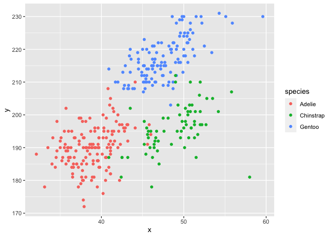

p8105_hw1_jc5924
================

``` r
library(tidyverse)
```

    ## ── Attaching packages ─────────────────────────────────────── tidyverse 1.3.2 ──
    ## ✔ ggplot2 3.3.5     ✔ purrr   0.3.4
    ## ✔ tibble  3.1.6     ✔ dplyr   1.0.7
    ## ✔ tidyr   1.2.0     ✔ stringr 1.4.0
    ## ✔ readr   2.1.2     ✔ forcats 0.5.1
    ## ── Conflicts ────────────────────────────────────────── tidyverse_conflicts() ──
    ## ✖ dplyr::filter() masks stats::filter()
    ## ✖ dplyr::lag()    masks stats::lag()

# Problem 1

### Download the package and include a summary of the dataset

``` r
data("penguins", package = "palmerpenguins")
names(penguins)
```

    ## [1] "species"           "island"            "bill_length_mm"   
    ## [4] "bill_depth_mm"     "flipper_length_mm" "body_mass_g"      
    ## [7] "sex"               "year"

``` r
summary(penguins)
```

    ##       species          island    bill_length_mm  bill_depth_mm  
    ##  Adelie   :152   Biscoe   :168   Min.   :32.10   Min.   :13.10  
    ##  Chinstrap: 68   Dream    :124   1st Qu.:39.23   1st Qu.:15.60  
    ##  Gentoo   :124   Torgersen: 52   Median :44.45   Median :17.30  
    ##                                  Mean   :43.92   Mean   :17.15  
    ##                                  3rd Qu.:48.50   3rd Qu.:18.70  
    ##                                  Max.   :59.60   Max.   :21.50  
    ##                                  NA's   :2       NA's   :2      
    ##  flipper_length_mm  body_mass_g       sex           year     
    ##  Min.   :172.0     Min.   :2700   female:165   Min.   :2007  
    ##  1st Qu.:190.0     1st Qu.:3550   male  :168   1st Qu.:2007  
    ##  Median :197.0     Median :4050   NA's  : 11   Median :2008  
    ##  Mean   :200.9     Mean   :4202                Mean   :2008  
    ##  3rd Qu.:213.0     3rd Qu.:4750                3rd Qu.:2009  
    ##  Max.   :231.0     Max.   :6300                Max.   :2009  
    ##  NA's   :2         NA's   :2

### Short description of the dataset

-   There are total of 8 varibles in the dataset that are species,
    island, bill_length_mm, bill_depth_mm, flipper_length_mm,
    body_mass_g, sex, year.
-   There are total of 344 rows and 8 columns.
-   The mean flipper length is equal to 200.9152047 mm.

### Scatterplot

``` r
penguins_df=
  tibble(
    x=penguins$bill_length_mm,
    y=penguins$flipper_length_mm,
    species=penguins$species
  )
ggplot(penguins_df,aes(x=x,y=y,color=species))+geom_point()
```

    ## Warning: Removed 2 rows containing missing values (geom_point).

<!-- -->

``` r
ggsave("penguins_df_scatterplot.pdf")
```

    ## Saving 7 x 5 in image

    ## Warning: Removed 2 rows containing missing values (geom_point).

# Problem 2

### Create a data frame

``` r
df_2=tibble(
    norm=rnorm(n=10,mean =0, sd=1),
    logical=norm>0,
    char=c("One","Two","Three","Four","Five","Six","Seven","Eight", "Nine","Ten"),
    fac_norm=factor(c("Low","Medium","High","Low","Medium","High","High", "Medium","Low","High"))
)
print(df_2)
```

    ## # A tibble: 10 × 4
    ##        norm logical char  fac_norm
    ##       <dbl> <lgl>   <chr> <fct>   
    ##  1 -0.0388  FALSE   One   Low     
    ##  2 -0.00857 FALSE   Two   Medium  
    ##  3  0.822   TRUE    Three High    
    ##  4 -0.233   FALSE   Four  Low     
    ##  5 -0.366   FALSE   Five  Medium  
    ##  6 -0.225   FALSE   Six   High    
    ##  7  0.0917  TRUE    Seven High    
    ##  8 -1.38    FALSE   Eight Medium  
    ##  9 -1.05    FALSE   Nine  Low     
    ## 10 -1.26    FALSE   Ten   High

### Take the means of each variable

``` r
mean(df_2$norm)
```

    ## [1] -0.3646346

``` r
mean(df_2$logical)
```

    ## [1] 0.2

``` r
mean(df_2$char)
```

    ## Warning in mean.default(df_2$char): argument is not numeric or logical:
    ## returning NA

    ## [1] NA

``` r
mean(df_2$fac_norm)
```

    ## Warning in mean.default(df_2$fac_norm): argument is not numeric or logical:
    ## returning NA

    ## [1] NA

-   We can take the means of numeric and logical variables; however, the
    means of character and factor vectors cannot be taken.

### Convert the varibles

``` r
logical_num=as.numeric(pull(df_2,logical))
char_num=as.numeric(pull(df_2,char),na.omit(char))
fac_num=as.numeric(pull(df_2,fac_norm))
mean(logical_num)
mean(char_num)
mean(fac_num)
```

-   After converting the logical, character and factor variables from
    their own types to the numeric type, it is possible to find the
    means of logical variable and factor variable. However, converting
    the character variable to numeric varible seems not possible, shown
    like ‘NAs introduced by cpercion’, even though I add ‘na.omit’ as a
    argument. Logical and factor variables can be converted to numbers
    because the logical variable is either ‘TRUE’ or ‘FALSE’ and that
    can be converted to ‘1’ or ‘0’, and there are three levels for the
    factor variable which can be converted to ‘1’,‘2’ and ‘3’. However,
    character variable cannot do that.
